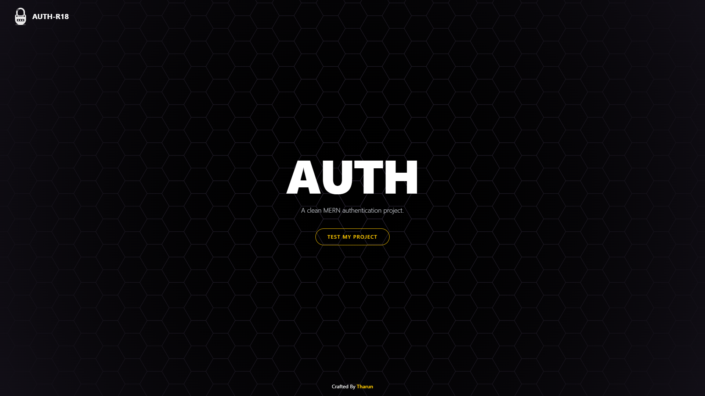

# AUTH-R18

A full-stack authentication system built with the MERN stack featuring secure user registration, login, email verification, and password recovery workflows.

## Screenshot

## Live Demo

🔗 https://authr18.vercel.app

## Features

* User Registration
* User Login
* User Logout
* Reset Password
* JWT Authentication
* Password Hashing with bcryptjs
* HTTP-Only Cookie Authentication
* Secure Authentication Flow
* Toast Notifications
* Responsive User Interface

## Tech Stack

### Frontend

* React
* Vite
* Tailwind CSS
* Axios
* React Toastify

### Backend

* Node.js
* Express.js
* JWT
* bcryptjs
* CORS

### Database

* MongoDB
* Mongoose

### Email Services

* Brevo
* Nodemailer

## Learning Outcomes

* JWT-based authentication
* Secure password hashing
* HTTP-only cookie authentication
* Password reset implementation
* Frontend and backend integration
* REST API development
* MongoDB data management
